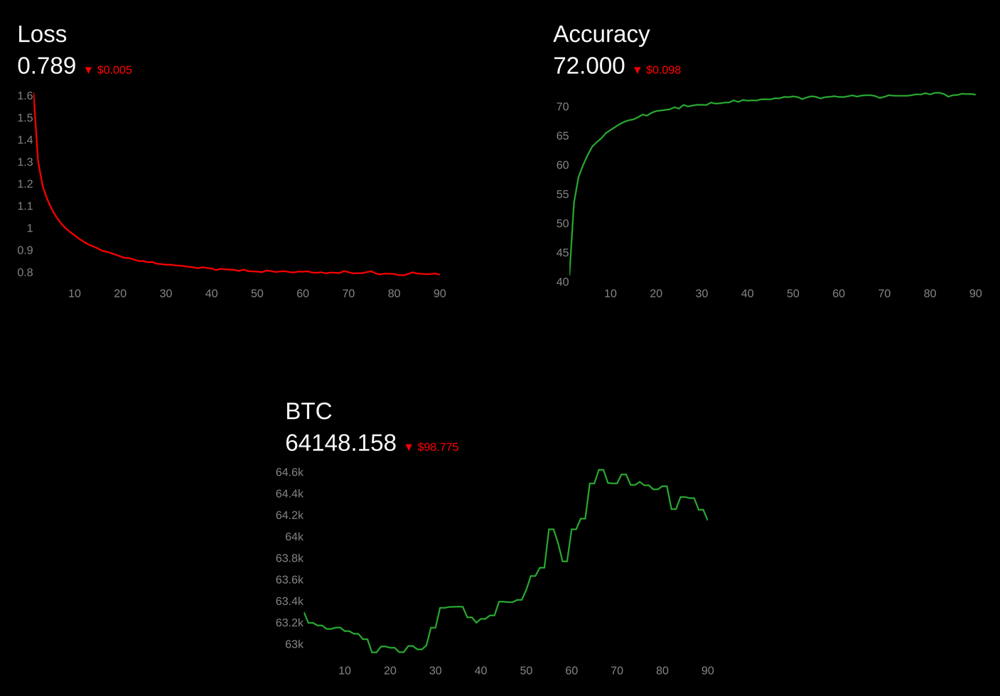

# Wandbinhood #

Simple plotting the gamblers, ml researchers, and unix ricers

Simple interface to push to a csv file, and another simple interface to do live updates on that single file

It's < 100 lines of code, go wild!




## Example Usage ##

To run the example plot:

```
git clone https://github.com/spikedoanz/wandbinhood/
cd wandbinhood
python3 -m venv venv
soource venv/bin/activate
pip install -r requirements.txt
flask run
```

To make your own plots with live updates, then also do:

```
from wandbinhood import create_project, append project

project_name = 'example'
create_project(project_name, ['loss', 'accuracy'])

epochs = 100
for epoch in epochs:
    ### Training code ###
    # loss = something
    # accuracy = something else
    apppend_project(project_name, [loss, accuracy])
```

Or to run the example training job with live updates

```
pip install -r requirements_training.txt
python example_project.py
```

Then, in a different terminal
```
flask run
```

And of course, you can visualize any arbitrary csvs. By editing app.py
```
PATH_TO_LOGS="./path_to_csv_folder/"
PROJECT_NAME="csv_file_name"
```
```
flask run
```

The flask server at 5000 will then plot your results in real time


## How it works ##

Basically, these two functions post to projects/project_name.csv

```
create_project(project_name, [fields,that,you,want,to,track])
append_project(project_name, [numbers,for,those,fields])
```

The flaak server reads from projects/project_name.csv, and makes a plot for each column in that csv

## Notes ##

This is not meant to be a complete project, this is just something I hacked together for a different project

How it works:

1. do a training run
2. push whatever numbers you want to a csv
3. flask run in the background
    3.1 watch the csv
    3.2 every column gets its own plot

## Some cool features I could add but am lazy ##

- [ ] Candlestick plots
- [ ] Guides for working with cloud training
- [ ] Different color schemes (catppuccin), and an easy switcher in config file

